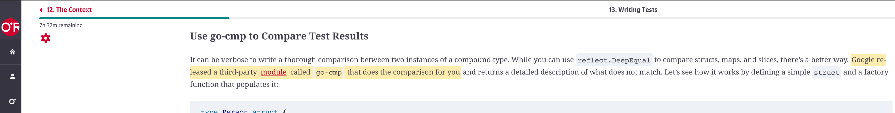
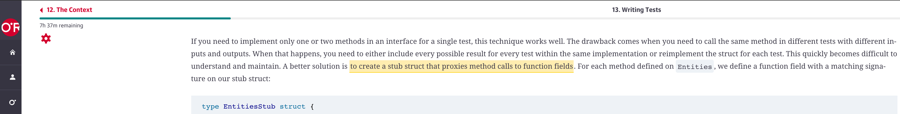
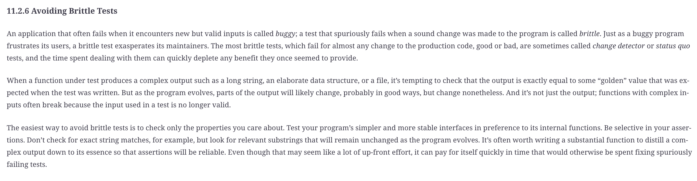

# Golang Review (July 14, 2021)

## Goals

* Drop anything from Ch.12 ("The Context") in *Learning Go* that we didn't get to last time... *unless there are questions/thoughts folks would like to share??*
* Cover Ch.13 "Writing Tests" and selected testing topics more broadly
  * go-cmp
  * table tests
  * stubbing/mocking
  * how we should identify bad vs good tests/testing
* Do a live TDD exercise
* Check in on self-learning strategies (which we didn't get to last time) and our roadmap for Golang/DevOps/Kount-focused learnings

----------------------------

* Profiling and race-detection: Probably save for next time (as we start on a 2-4 session concurrency unit) unless we have time today

## Assignment for July 28

Readings:

* *Learning Go*: Ch.10
* *Concurrency in Go*: Chs. 1-3

Exercises:

1. Collaboration to fill in the checklists for "good" and "bad" tests below: Ping me with your GitHub username; I'll add you as a collaborator on this repo. Submit a PR with >= 2 additions to the "Good tests" checklist and to the "Bad tests" checklist below. (These should be characteristics/flags that can help us identiry a test or set of tests that would normally be "good" or "bad" examples of best-practice unit testing.) If there are other items on the checklist when you submit yours, also read through the checklist and re-prioritize it so the more important characteristics/flags are at the top of the list (as you interpret things).
2. Give the [stretchr/testify `mock` package](https://github.com/stretchr/testify#mock-package) a test-drive if you haven't before. This is something I wanted to do during our session today, but we didn't have time.

## "Lab"

### **1. TDD Exercise**

* Clone [this](https://github.com/us-learn-and-devops/todoapi) super-simple little "todo list" app.

We're going to do some TDD to implement a couple functions here.
The goal is not to write interesting/clever/time-consuming Go for this exercise, but to rapidly practice our dev and merge process, and experiment with a couple ideas/concepts from the testing material we're covering.

Our task: We're working on implementing the create-todo endpoint (POST to `/todo`).

We'll need to work on at least 4 different functions + tests.

----------------------------

Let's begin by checking out the starter project and...

1. Decide on our TDD approach.
2. Decide what are the best candidates for a series of atomic commits + merges. We'll take this to somewhat of an extreme for the sake of illustration/practice.
3. Decide on our git strategy for planned flexibility.

----------------------------

Let's start by creating the simplest, "dumbest" version of the endpoint implementation we can ***but still test it*** at the top level.

* In other words, let's start with the top-level scaffolding/plumbing, but ignore many details until we're forced not to.
  * We're not going to use yoda for this toy project... because we're not crazy or into self-torture. But let's use Postman because it's easy for this little project: Create a basic Postman test for a POST to `/todo`.
  * Build the simplest possible handler to satisfy the test.
  * We could skaffold the rest of the planned function calls, without yet actually implementing them -- probably doesn't matter if we choose to do that or not now.
    * But if we *do* do this now, there could be an advantage for helping our team collaborate on finishing up this work. Let's talk more about that presently...
* We've reached our first fault line: Commit, (rebase if it makes sense) and merge.

----------------------------

We'll start the real implementation [here](https://github.com/us-learn-and-devops/todoapi/blob/master/internal/storage/in_memory_db.go#L21), with the `SaveTodo` function.

(We're starting there because implementing this function represents the smallest piece of independent "real" implementation we could merge into the project.)

* Let's do TDD: Start with the simplest test function that makes sense so far: Just a single test-case.
  * **Do not copy/paste an existing test from somewhere else.** Use your own knowledge of how test functions are set up.
  * First version isn't even a table test: We don't need it yet.

----------------------------

* Incidental question: Why does a new unit test function require a ***pointer*** type (`*testing.T`) argument?

----------------------------

* Notice how easy it is to fulfill a simple error-return test case... and how nearly useless that test case is on its own.
* Keep doing TDD iteration, adding more test cases...
  * Replace the initial test function with a table test as you add test cases. But again, do not use copy/paste as a crutch: Create your test setup from scratch.
* Notice that a `Todo` has an ID field, but that value isn't known until the `Todo` instance is created, so we can't use `reflect.DeepEqual` like we normally might to compare expected vs actual results.
  * Try using `go-cmp`

* Notice that we can't *finish* implementing all of `SaveTodo` unless we also implement `GetTodoByName`.
  * But let's *not* do that: Let's leverage this natural fault-line in our implementation to practice using the "KISS" (keep it simple, stupid) principle: Stub `GetTodoByName` and save its implementation to commit later.
* We need to decide where it makes sense to use `t.Fatal` vs `t.Error`.
* We've reached our second fault line: Commit, (rebase if it makes sense) and merge.

----------------------------

Let's move on to the `Save` [function](https://github.com/us-learn-and-devops/todoapi/blob/master/internal/domain/todo/todo.go#L5).

We can choose to stub/mock the DB (even though the DB is fake at this point).

* [According to Martin Fowler](https://martinfowler.com/articles/mocksArentStubs.html#ClassicalAndMockistTesting), if we use the real `InMemoryDB` object, we're doing "classical TDD"
* If we mock it, we're doing "mockist TDD"

Which do you vote for? Why?

Let's go ahead and use the stub/mock approach. There are a bunch of ways to do that.

* Find and share what you think is a good example of test stubbing/mocking in an existing Kount project.
* Let's test drive Bodner's suggestion "to create a stub struct that proxies method calls to function fields".

* OK. Nice. Now let's test drive using the [stretchr/testify `mock` package](https://github.com/stretchr/testify#mock-package) instead.

* Iterate on the TDD until we're done here...
* We've reached our third fault line: Commit, (rebase if it makes sense) and merge.

----------------------------

...and so on

You can keep practicing if you want to later on.

But before we move on, consider for a moment implementing the [GetTodoList](https://github.com/us-learn-and-devops/todoapi/blob/master/internal/storage/in_memory_db.go#L25) function and writing unit tests for it.
Let's chat about this example soon in the next section...

### **2. Checklist for (a) Bad Unit Test(s) :scream:**

(discuss and create list)

* A bad unit test store an expected value in a "foo" variable instead of "expectedFoo". 
* If we are writing unit test for private methods then it will be bad practice. 
* Not able to run quickly.
* ...
* ...
* ...

As part of this discussion, consider what [Donovan and Kernighan have to say](https://learning.oreilly.com/library/view/the-go-programming/9780134190570/ebook_split_105.html) about "avoiding brittle tests":

### **3. Checklist for (a) Good Unit Test(s) :innocent:**

(discuss and create list)

* A good unit test should be easily readable. By this I mean that the setup should be clear, your test values defined in such a way that it's easy to tell what is being tested. The action portion ( usually a method call ) is pretty straight forward, Getting the returns or values to assert expectations on. Finally the assertions should comunicate clearly what the failure is if it fails. you shouldn't have to dig back through to figure out what failed in a failure instance.
* A good unit test should be reliable. If your unit test is flacky, the system under test isn't set up in a way that you are only testing what you are asserting on. Also it's a possible indicator that you haven't throughly tested possible error states of the system.

* A good unit test should have all the test methods are designed around arrange, act and assert.
* A good unit test should be run any time on any place without needing configuration.
* A good unit test don’t need access to database and network resources.
* A good unit test should cover all possible scenarios and strive for high code coverage and ensuring good quality metrics. Unit Test methods must exercise all possible use case scenarios to test the input validations, errors messages and exceptions and so on.
* A good unit test must be independent of another test. In other words, no collateral damage. Hence, a Unit Test must focus only on a small aspect of big functionality. When this Unit Test fails, it should be easy to discover where the issue is in the code. In other words can be tested in isolation.

> > > > > > >   That's why I'm reading clean code book :laughing::laughing: (SJ) <-- :laughing: (RK)

* ...
* ...
* ...
* ...

### **4. Self-Learning Strategies / Learning Roadmap**

(discuss)
